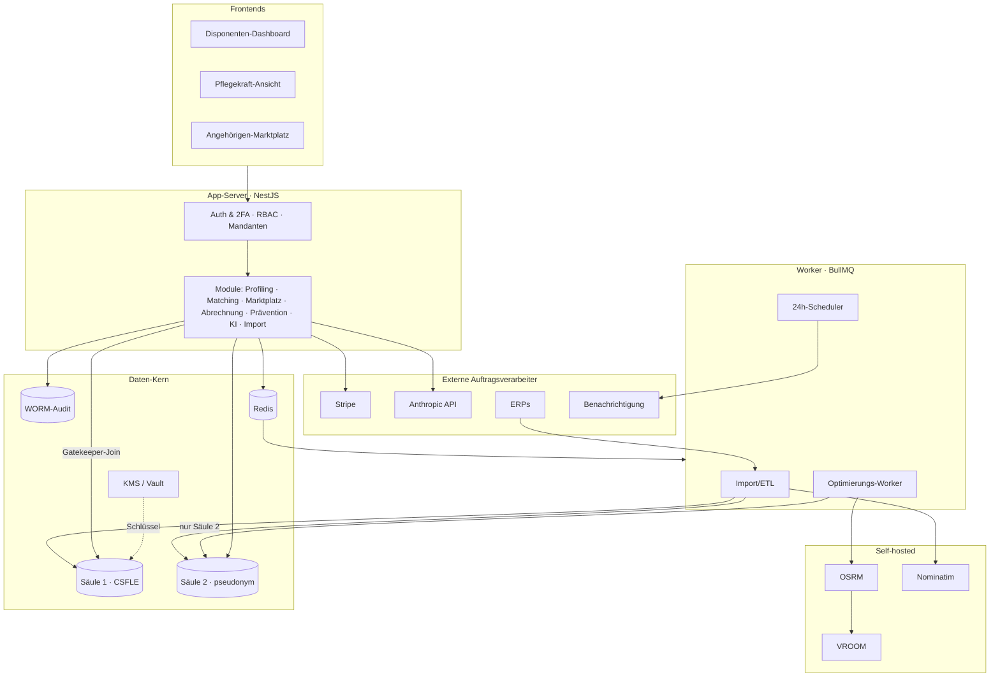

# Pflichtenheft

## Browserbasierte Tourenoptimierungs- und Vermittlungsplattform für die ambulante Pflege

**Projekt:** Pflegelotse / Tourenoptimierung (Arbeitstitel)
**Dokumenttyp:** Pflichtenheft
**Stand:** 23.06.2026 · Version 1.0
**Status:** Entwurf zur Abstimmung (Validierungsphase)

---

## Inhalt

1. Einleitung
2. Zielbestimmung
3. Produkteinsatz
4. Produktübersicht
5. Produktfunktionen
6. Produktdaten
7. Produktleistungen
8. Qualitätsanforderungen
9. Benutzungsoberfläche
10. Sicherheit und Datenschutz
11. Technische Produktumgebung
12. Gliederung in Teilprodukte
13. Abnahmekriterien
14. Projektplan und Meilensteine
15. Annahmen, Risiken und offene Punkte
16. Glossar

---

## 1. Einleitung

### 1.1 Zweck und Geltungsbereich

Dieses Pflichtenheft spezifiziert eine browserbasierte Anwendung mit zwei sich ergänzenden
Zwecken:

- **Für Angehörige:** schneller und verlässlicher einen passenden ambulanten Pflegedienst für
  pflegebedürftige Verwandte finden — über ein umgekehrtes Bietverfahren (Reverse Bidding) mit
  verbindlicher Rückmeldung.
- **Für ambulante Pflegedienste:** ihre Touren optimieren und Kapazitätslücken passgenau füllen
  und so im Verkäufermarkt zusätzliche Marge auf bestehende Routen erzielen.

Das Dokument konsolidiert die zehn Grundlagendokumente (Lösungsüberblick, Software- und
Systemarchitektur, technische und funktionale Spezifikation, nicht-funktionale Anforderungen,
Datenschutz-Umsetzung, Geschäftsmodell, Test-/Abnahmekonzept, Projektplan sowie Annahmen/
Risiken) zu einer prüfbaren Gesamtspezifikation mit nachverfolgbaren Anforderungs-IDs.

### 1.2 Anforderungs-Konventionen

Anforderungen sind eindeutig gekennzeichnet: **/F…/** Funktion, **/D…/** Daten, **/L…/**
Leistung, **/Q…/** Qualität. Priorität: **Muss** (zwingend MVP), **Soll** (wichtig, zeitnah),
**Kann** (optional/später).

### 1.3 Grundlegende Lösungsprinzipien (P1–P8)

Jede Anforderung ist auf folgende Maximen rückführbar:

| ID | Prinzip |
|---|---|
| P1 | Wert ist Marge, nicht Lead — verkauft wird Tour-Effizienz, nicht Lead-Volumen |
| P2 | Aufsatz, nicht Ersatz — die etablierten Pflege-ERPs werden ausgelesen, nicht abgelöst |
| P3 | Privacy by Design — 2-Säulen-Trennung der Daten (Art. 25 DSGVO) |
| P4 | Datensparsamkeit und Datensouveränität — self-hosted Routing/Geocoding, EU-Hosting |
| P5 | Pseudonymisierung als Sicherheitspuffer — Crypto-Shredding, WORM-Audit, DB-RBAC |
| P6 | Leck-Sicherheit durch Design — Abrechnung an technisch erzwingbare Ereignisse gekoppelt |
| P7 | Betreibbarkeit durch eine Person — modularer Monolith, Einfachheit vor Optimalität |
| P8 | Validierung vor Code — Geschäftsannahme zuerst manuell beweisen |

---

## 2. Zielbestimmung

### 2.1 Musskriterien

Das Produkt **muss**:

- Angehörigen ermöglichen, einen Pflegebedarf strukturiert und anonym einzustellen und über
  ein Reverse-Bidding-Verfahren mehrere Dienste-Angebote zu erhalten.
- Jedem Bedarf eine **verbindliche Rückmeldung innerhalb von 24 Stunden** garantieren.
- Pflegediensten passgenaue Tourenlücken-Treffer zu eingehenden Bedarfen/Klienten liefern
  (Fit-Score) und ihre Touren visualisieren.
- Klientendaten nach dem **2-Säulen-Modell** datenschutzkonform verarbeiten (Art. 9 DSGVO).
- Stammdaten aus Branchensoftware importieren (CSV im MVP).
- Die Betroffenenrechte (Auskunft, Löschung) technisch umsetzen.

### 2.2 Wunschkriterien (Soll/Kann)

- KI-gestützter Pflegelotse zur Navigation und Bedarfsstrukturierung (Soll).
- ERP-Konnektoren über Adapter (Soll).
- Präventionsmodul nach §5 Abs. 1a SGB XI / BEEP (Soll).
- Mehrsprachigkeit (Soll).
- Automatische Komplett-Re-Optimierung der Touren (Kann).
- Kostenlose Tools als Nachfrage-Funnel (Soll).

### 2.3 Abgrenzungskriterien (Out of Scope)

Das Produkt leistet **ausdrücklich nicht** (verbleibt beim ERP/System of Record):

| Nicht enthalten | Grund |
|---|---|
| Pflegedokumentation (Leistungsnachweise, MDK-Doku) | ERP |
| Abrechnung mit Pflege-/Krankenkassen (SGB XI/V) | ERP |
| Vollständige Dienst-/Schichtplanung (HR, ArbZG) | Dienstplan-System |
| Echtzeit-Navigation / Fahrzeugtracking | planerisch, nicht turn-by-turn |
| Stammdatenhaltung als System of Record | ERP bleibt führend |
| Pflegefachliche/medizinische Bewertung (Pflegegrad) | als Input übernommen, nicht entschieden |
| Vertrags-/Zahlungsabwicklung Klient ↔ Dienst | nur Anbahnung/Matching |

**Regulatorische Einordnung:** Die Anwendung ist nach derzeitiger Einordnung **kein
Medizinprodukt** (keine medizinischen Entscheidungen) und agiert datenschutzrechtlich als
**Auftragsverarbeiterin** (Art. 28); Verantwortlicher bleibt der jeweilige Dienst. *(Beides
fachjuristisch zu bestätigen — keine Rechtsberatung.)*

---

## 3. Produkteinsatz

### 3.1 Anwendungsbereich

Vermittlung und Tourenoptimierung in der ambulanten Pflege; Start als Pilot in einer Region
(Freiburg, 30-km-Umkreis), danach mehrregionale Skalierung.

### 3.2 Zielgruppen

| Nutzergruppe | Rolle | Hauptaufgabe |
|---|---|---|
| Disponent / PDL | `disponent` | Tourenplanung, Lückenfüllung, Matching |
| Pflegekraft | `pflegekraft` | Tour des Tages einsehen (mobil) |
| Angehörige(r) | `angehoeriger` | Bedarf einstellen, Dienst auswählen |
| Dienst-Inhaber | `admin` | Nutzer-/Tarifverwaltung des Mandanten |
| Betreiber | `plattform_admin` | Betrieb (ohne Routine-PII-Zugriff) |

### 3.3 Betriebsbedingungen

Browserbasiert, EU-Hosting, Dauerbetrieb mit angestrebter Verfügbarkeit 99,5 %. Solo-Betrieb
in der Anfangsphase (P7).

---

## 4. Produktübersicht

Zweiseitige Plattform: Die **Nachfrage-Seite** (Angehörige) stellt Bedarfe ein; die
**Angebots-Seite** (Dienste) bewirbt sich über Angebote und nutzt parallel die
Tourenoptimierung. Kern ist eine Matching-Engine, die Bedarfe nach tatsächlicher Tour-Geometrie
(geringster Mehrweg unter Zeitfenster- und Qualifikationsbedingungen) bewertet. Alle
Klientendaten liegen im 2-Säulen-Datenmodell; der Optimierungs-Worker sieht ausschließlich
pseudonymisierte Daten.

---

## 5. Produktfunktionen

### 5.1 Bedarfs-Profiling /F100/

Strukturierte Erfassung des Pflegebedarfs als kanonische Eingabe für Matching und Marktplatz.

| ID | Anforderung | Prio |
|---|---|---|
| /F110/ | Angehörige erfassen den Bedarf in zwei Schritten (Pflegegrad, Wohnsituation, Abwesenheiten, Leistungen) | Muss |
| /F120/ | Dienste pflegen Klientenprofile (Zeitfenster, Leistungskomplexe, Qualifikation, Bezugspflege) | Muss |
| /F130/ | Adressen werden geocodiert; nur Koordinaten gelangen in Säule 2, Adresse bleibt Säule 1 | Muss |
| /F140/ | Leistungen werden über standardisierte Leistungskomplex-Codes normalisiert | Muss |
| /F150/ | Bedarf bleibt marktplatzseitig anonym bis zur Auswahl eines Dienstes | Muss |

### 5.2 Echtzeit-Tourenmatching /F200/

| ID | Anforderung | Prio |
|---|---|---|
| /F210/ | Fit-Score je Tour: marginale Einfügekosten unter Zeitfenster- und Qualifikationsbedingungen | Muss |
| /F220/ | Interaktive Antwortzeit (< 1 s) über vorberechnete, gecachte Reisezeit-Matrizen | Muss |
| /F230/ | Trefferliste sortiert nach Mehrweg (Mehrweg-Minuten, Qualifikation, Einfügeposition) | Muss |
| /F240/ | Schwere Komplett-Re-Optimierung läuft asynchron über die Job-Queue | Soll |
| /F250/ | Marktplatzweites Matching: Bedarf gegen alle Dienste im 30-km-Umkreis | Muss |

### 5.3 Reverse Bidding / Marktplatz /F300/

| ID | Anforderung | Prio |
|---|---|---|
| /F310/ | Ein Bedarf wird allen passenden Diensten gleichzeitig angezeigt | Muss |
| /F320/ | Dienste geben verbindliche Angebote ab; Statusmarker verhindert Doppelarbeit | Muss |
| /F330/ | Angehöriger vergleicht Angebote und wählt einen Dienst | Muss |
| /F340/ | Erst die Auswahl gibt die Kontaktdaten an genau diesen Dienst frei (Anti-Leakage, P6) | Muss |
| /F350/ | Express-Bedarfe werden priorisiert | Soll |

### 5.4 Verbindliche 24-h-Rückmeldung /F400/

| ID | Anforderung | Prio |
|---|---|---|
| /F410/ | Zustandsautomat je Bedarf: offen → in_bearbeitung → vergeben/abgesagt | Muss |
| /F420/ | Fan-out an passende Dienste per SMS/Push/E-Mail | Muss |
| /F430/ | Verzögerter Job (T+24 h); ohne Zusage automatische, klare Absage | Muss |
| /F440/ | SLA-Monitoring (Rückmeldequote, Zeit bis erste Reaktion) | Soll |

### 5.5 Schnittstellen / Adapter /F500/

| ID | Anforderung | Prio |
|---|---|---|
| /F510/ | CSV-Import aus bestehender Pflegesoftware (MVP) | Muss |
| /F520/ | Ports-&-Adapters-Architektur mit kanonischem Domänenmodell | Muss |
| /F530/ | ERP-Konnektoren (MediFox DAN, Vivendi, Snap) als austauschbare Adapter | Soll |
| /F540/ | Idempotenter Import über externe Quell-ID | Muss |
| /F550/ | ETL teilt jeden Import sofort in Säule 1 (PII) und Säule 2 (operativ) | Muss |
| /F560/ | Optionaler Outbound-Adapter schreibt optimierte Touren ins ERP zurück | Kann |

### 5.6 KI-Pflegelotse /F600/

| ID | Anforderung | Prio |
|---|---|---|
| /F610/ | Dialogassistent (Anthropic Claude) zur Navigation und Bedarfsstrukturierung | Soll |
| /F620/ | Tool Use zur Plattform-Integration (Leistungen nachschlagen, Bedarf vorbefüllen) | Soll |
| /F630/ | Guardrails: keine medizinische/pflegefachliche Bewertung, Verweis auf §7a-Beratung | Muss (bei /F610/) |
| /F640/ | Datenminimierung: keine unnötigen personenbezogenen Daten an die API | Muss (bei /F610/) |

### 5.7 Kostenlose Tools /F700/

| ID | Anforderung | Prio |
|---|---|---|
| /F710/ | Pflegegrad-Rechner, Budget-/Leistungsübersicht, Antrags-Assistent, Checklisten | Soll |
| /F720/ | Überwiegend clientseitig, ohne PII (DSGVO-arm, SEO-fähig) | Soll |
| /F730/ | Dauerhaft kostenlos für Angehörige (Nachfrage-Funnel) | Soll |

### 5.8 Mehrsprachigkeit /F800/

| ID | Anforderung | Prio |
|---|---|---|
| /F810/ | i18n mit ausgelagerten Katalogen; Startsprachen DE, EN, TR, RU, UK, PL, AR | Soll |
| /F820/ | RTL-Unterstützung (Arabisch); locale-korrekte Formate | Soll |
| /F830/ | Rechtskritische Strings werden menschlich geprüft, nicht nur maschinell übersetzt | Muss (bei /F810/) |

### 5.9 Präventionsmodul §5 Abs. 1a SGB XI / BEEP /F900/

| ID | Anforderung | Prio |
|---|---|---|
| /F910/ | Geführte, ressourcenorientierte Bedarfserhebung im §37-Abs.-3-Beratungsworkflow | Soll |
| /F920/ | Empfehlungs-Generator: Ressourcen/Risiken → §20-SGB-V-Präventionsangebote | Soll |
| /F930/ | Strukturierte Präventionsempfehlung als exportierbares Dokument für die Pflegekasse | Soll |
| /F940/ | KI unterstützt Formulierung/Angebotssuche; fachliche Entscheidung bleibt beim Menschen | Muss (bei /F910/) |

### 5.10 Abrechnung und Tarife /F1000/

| ID | Anforderung | Prio |
|---|---|---|
| /F1010/ | Angehörige: Basis-Vermittlung dauerhaft kostenlos | Muss |
| /F1020/ | Express 19,90 € einmalig (Stripe Checkout) | Soll |
| /F1030/ | Dienste: SaaS-Abo gestaffelt nach Dienstgröße (Stripe Subscription) | Muss |
| /F1040/ | Vermittlungsgebühr ausgelöst durch Kontaktfreigabe-Ereignis (leck-sicher) | Muss |
| /F1050/ | Gründungspreis-Lock-in; Trial → zahlendes Abo | Soll |
| /F1060/ | GoBD-konforme Rechnungen, DATEV-Export, USt-Behandlung | Muss |

### 5.11 Betroffenenrechte (DSGVO) /F1100/

| ID | Anforderung | Prio |
|---|---|---|
| /F1110/ | Recht auf Löschung (Art. 17) per Crypto-Shredding, atomar mit Audit-Eintrag | Muss |
| /F1120/ | Recht auf Auskunft/Übertragbarkeit (Art. 15/20) als portables JSON | Muss |
| /F1130/ | WORM-Audit-Log aller datenschutzrelevanten Vorgänge | Muss |

---

## 6. Produktdaten

Datenbank `pflege_prod`, drei Collections, alle mit `tenant_id` (Mandantentrennung).

| ID | Datenbestand | Inhalt |
|---|---|---|
| /D100/ | `klienten_identitaet` (Säule 1) | Name, exakte Adresse, Kontakt — CSFLE-verschlüsselt |
| /D200/ | `klienten_operativ` (Säule 2) | Koordinaten, Pflegegrad, Zeitfenster, Leistungen — nur `pseudonym_id` |
| /D300/ | `touren` (Säule 2) | Einsätze, Reihenfolge, Kennzahlen (Fahrzeit, Auslastung) |
| /D400/ | `bedarfe` (Säule 2) | eingestellte Anfragen der Marktplatz-Seite |
| /D500/ | `gdpr_audit_log` | schreibgeschützt (WORM), HMAC-gehasht, ohne Klarnamen |

**/D600/ (Muss):** Verknüpfung der Säulen ausschließlich über zufällige UUIDv4
(`pseudonym_id`). **/D700/ (Muss):** Serverseitige Schema-Validierung sperrt PII in Säule 2:

```javascript
db.createCollection("klienten_operativ", {
  validator: { $jsonSchema: {
    bsonType: "object",
    required: ["pseudonym_id", "tenant_id", "geo", "status"],
    properties: {
      pseudonym_id: { bsonType: "string",
        pattern: "^[0-9a-f]{8}-[0-9a-f]{4}-4[0-9a-f]{3}-[89ab][0-9a-f]{3}-[0-9a-f]{12}$" },
      pflegegrad: { bsonType: "int", minimum: 1, maximum: 5 },
      status: { enum: ["aktiv", "pausiert", "beendet"] },
      // PII-Blackbox: identifizierende Felder werden abgewiesen
      vorname:  { not: { bsonType: ["string","object","array","null"] } },
      nachname: { not: { bsonType: ["string","object","array","null"] } },
      adresse:  { not: { bsonType: ["string","object","array","null"] } }
    }
  }},
  validationLevel: "strict", validationAction: "error"
});
```

---

## 7. Produktleistungen

| ID | Leistung | Zielwert |
|---|---|---|
| /L100/ | Antwortzeit Fit-Score (interaktiv) | < 1 s |
| /L200/ | Verbindliche Rückmeldung je Bedarf | ≤ 24 h |
| /L300/ | Verfügbarkeit (SLO) | 99,5 % |
| /L400/ | Skalierung | horizontal; OSRM pro Region; DB-Sharding nach `tenant_id` |
| /L500/ | Datenmengen | mandantengescopt; geeignete Indizes (`tenant_id`+`pseudonym_id`, 2dsphere) |

---

## 8. Qualitätsanforderungen

| ID | Qualitätsmerkmal | Bedeutung | Umsetzung |
|---|---|---|---|
| /Q100/ | Sicherheit/Datenschutz | sehr hoch | 2-Säulen, CSFLE, RBAC, Crypto-Shredding, WORM-Audit, DSFA |
| /Q200/ | Korrektheit (Matching) | sehr hoch | Golden-Set- und Constraint-Tests |
| /Q300/ | Benutzbarkeit | hoch | aufgabenorientiert, Domänensprache, Ein-Klick-Lückenfüllung |
| /Q400/ | Barrierefreiheit | hoch | WCAG 2.1 AA / BFSG; Text-/Tabellenalternative zur Karte |
| /Q500/ | Zuverlässigkeit/Verfügbarkeit | hoch | Replica-Set, Failover, Graceful Degradation |
| /Q600/ | Effizienz | hoch | gecachte Matrizen, asynchrone Optimierung |
| /Q700/ | Wartbarkeit | hoch | modularer Monolith, Ports & Adapters (P7) |

---

## 9. Benutzungsoberfläche

Drei Oberflächen mit bewusst unterschiedlichem Geräte-Fokus:

| Oberfläche | Primäres Gerät | Schwerpunkt |
|---|---|---|
| Disponenten-Dashboard | Desktop/Tablet | Karte + Zeitstrahl, Kennzahlen, Konfliktmarkierung |
| Pflegekraft-Ansicht | Mobile-first | Tour des Tages, offline-tauglich (Tour-Cache) |
| Angehörigen-/Marktplatz | Mobile-first | Zwei-Schritte-Bedarfserfassung, Reverse Bidding |

**Bedienprinzipien (Muss):** aufgabenorientierter Einstieg, Ein-Klick-Lückenfüllung, vertraute
Karten-/Zeitstrahl-Metaphern, Fehlervermeidung/Umkehrbarkeit, Domänensprache, geführter
Erststart. **Barrierefreiheit (Muss):** Tastaturbedienbarkeit, Kontrast ≥ 4,5:1, nie Farbe
allein, skalierbarer Text bis 200 %, `prefers-reduced-motion`, text-/tabellenbasierte
Kartenalternative.

---

## 10. Sicherheit und Datenschutz

Da Adressen mit Leistungsangaben verarbeitet werden, handelt es sich um besondere Kategorien
(Art. 9 DSGVO). Grundlage ist Privacy by Design (Art. 25): das 2-Säulen-Modell.

- **/Q110/ TOM (Art. 32):** Verschlüsselung at rest (CSFLE) und in transit (TLS 1.3),
  Pseudonymisierung, DB- und App-RBAC, verpflichtende TOTP-2FA für Rollen mit
  Klientendatenzugriff, Schlüsseltrennung im KMS, WORM-Audit, EU-Hosting, AVV, VVT (Art. 30).
- **/Q120/ RBAC-Grenze:** Der Optimierungs-Worker nutzt einen Service-Account ohne Leserecht
  auf Säule 1 — automatisiert getestet.
- **/Q130/ Löschung (Art. 17):** Crypto-Shredding (Vernichtung des klientenspezifischen
  Data-Keys) macht Säule 1 auch in Backups unlesbar; Tombstone-Abgleich nach Restore.
- **/Q140/ Auskunft (Art. 15/20):** zweistufiger Join über Gatekeeper-Rolle, portables JSON.
- **/Q150/ Datenpannen (Art. 33):** Säule-2-Abfluss → kein Personenbezug → keine Meldepflicht;
  Säule-1-Abfluss → meldepflichtig, mit Audit-Nachweis; 72-h-Frist.
- **/Q160/ Schlüsselverwaltung:** CMK im KMS, pro-Klient-DEK, Audit-Pepper via Vault Transit
  mit `pepper_version`; automatisierte Rotation; Argon2id-Fallback.

---

## 11. Technische Produktumgebung

### 11.1 Technologie-Stack (Festlegung)

| Bereich | Festlegung |
|---|---|
| Sprache/Runtime | Node.js 20 LTS + TypeScript |
| Backend | NestJS (modularer Monolith) |
| Datenbank | MongoDB 7.x (Atlas EU) mit CSFLE *(MongoDB vs. Postgres: offener Punkt O8)* |
| Key Management | AWS KMS (`eu-central-1`) oder HashiCorp Vault |
| Routing/Optimierung | OSRM + VROOM (self-hosted) |
| Geocoding | Nominatim (self-hosted) |
| Job-Queue/Cache | BullMQ + Redis |
| Frontend | React + TypeScript, MapLibre GL |
| Auth | Argon2id + TOTP (RFC 6238) |
| Billing | Stripe (SEPA/EU) |
| KI | Anthropic Claude (Sonnet/Haiku) über `/v1/messages` |
| Hosting | Hetzner Cloud (DE) + Atlas EU |
| Containerisierung/CI | Docker + docker-compose; GitHub Actions |

### 11.2 Systemarchitektur (Komponenten und Datenfluss)



### 11.3 Betrieb und Deployment

Compute und self-hosted Dienste auf Hetzner (DE), Datenbank auf Atlas EU. Zustandslose
App-Instanzen hinter Load Balancer; Worker als unabhängige Queue-Consumer; OSRM pro Region.
Gestaffelter Rollout (Pilotregion zuerst); strukturierte Logs ohne PII; Backup mit
Crypto-Shredding-bewusstem Restore. Das Datenschutz-Gate (DSFA) ist vor jedem Go-Live zwingend.

---

## 12. Gliederung in Teilprodukte

| Komponente | Verantwortung |
|---|---|
| Disponenten-Dashboard | Tourenplanung, Lückenfüllung, Kennzahlen |
| Pflegekraft-Ansicht | Tour des Tages, mobil/offline |
| Angehörigen-/Marktplatz-Frontend | Bedarfserfassung, Reverse Bidding, Tools |
| App-Server (Monolith) | Auth/RBAC/Mandanten, Geschäftslogik aller Module |
| Import/ETL-Worker | Normalisieren, geocodieren, Säulen-Split |
| Optimierungs-Worker | Fit-Score, Re-Optimierung (nur Säule 2) |
| 24h-Scheduler | Fristüberwachung, Absage, Fan-out |
| OSRM / VROOM / Nominatim | Routing, Optimierung, Geocoding (self-hosted) |
| Datenkern (MongoDB/Redis/KMS) | Säulen, Audit-Log, Queue/Cache, Schlüssel |
| Externe Dienste | Stripe, Anthropic, ERP-Adapter, Benachrichtigung |

---

## 13. Abnahmekriterien

Abnahme erfolgt in **Gates** (fachlich → nicht-funktional → Datenschutz/Sicherheit).

- **/A100/ Definition of Done:** Akzeptanzkriterien erfüllt, alle automatisierten Tests grün,
  NFR-Schwellen eingehalten (Fit-Score < 1 s, WCAG 2.1 AA), Sicherheits-/Datenschutzprüfungen
  bestanden, Dokumentation aktuell.
- **/A200/ Fachliche Abnahme (UAT):** Abnahmeszenarien je Funktion mit echten Diensten
  (Tour planen + Ein-Klick-Aufnahme; Bedarf → Auswahl → Kontaktfreigabe → Abrechnung;
  24-h-Absage; ERP-Import in beide Säulen).
- **/A300/ Datenschutz-Gate (hart):** DSFA (Art. 35) abgeschlossen, AVVs, VVT, TOMs,
  funktionsfähige Lösch-/Auskunftsprozesse, Pentest-Findings behoben.
- **/A400/ Barrierefreiheit:** WCAG-2.1-AA-Nachweis, Barrierefreiheitserklärung.
- **/A500/ Schnittstellen:** jeder ERP-Adapter gegen reale Beispiel-Exporte abgenommen.

**Mängelklassen:** Blocker (PII-Leck, RBAC-Bruch, Datenverlust) und Kritisch (Fit-Score
falsch, 24-h-Absage feuert nicht, Abrechnung fehlerhaft) sperren den Go-Live.

---

## 14. Projektplan und Meilensteine

| Phase | Meilenstein | Exit-Kriterium |
|---|---|---|
| 0 Validierung | M0.1–M0.3 Angebotsseite, Nachfrage/Express, Concierge | erste Vermittlungen |
| 0 Validierung | **M0.4 Go/No-Go** | belastbare Zahlungsbereitschaft |
| 1 MVP | M1.1 Datenkern & Sicherheit | Worker ohne PII-Zugriff (Test grün) |
| 1 MVP | M1.2–M1.5 Import, Routing/Fit-Score, Dashboard, Marktplatz | Kern-Nutzerreise grün |
| 2 Abnahme | M2.1–M2.2 Test-Gates, **DSFA** | hartes Gate bestanden |
| 2 Abnahme | M2.3 Pilot-Go-Live Freiburg | stabile reale Nutzung |
| 3 Monetarisierung | M3.1–M3.3 Tarife, KPIs, ERP-Konnektoren | erste MRR |
| 4/5 | M4.1–M5.2 Präventionsmodul, Partner, zweite Region, Voll-Optimierung | getragene Skalierung |

**Kritischer Pfad:** Go/No-Go (M0.4) → Datenkern (M1.1, nicht nachrüstbar) → DSFA (M2.2, vor
jedem Go-Live). Das unbezahlte Drei-Monats-Fenster deckt nur Phase 0; danach Umsatz oder
Partner.

---

## 15. Annahmen, Risiken und offene Punkte (Auszug)

**Kritische Annahmen:** Dienste haben füllbare Tourenlücken (A1) und zahlen dafür (A2);
Angehörige nutzen die Plattform im Bedarfsmoment (A4); Liquidität in einer Region erreichbar
(A5); 3 Monate unbezahlt, danach Umsatz/Partner (A15).

**Schwerste Risiken:** Liquidität/Henne-Ei (R2) und Finanzierungslücke (R13) — durch
Validierung vor Bau und validierten Pilot als Partner-Pfund gemindert; Datenpanne (R4) — durch
die 2-Säulen-Architektur stark gedämpft; Solo-Überlastung (R5) — durch maßvolles Bauen und
frühen Partner.

**Wichtige offene Punkte:** MDR-Status (O1), DSFA (O2), Hosting Atlas vs. Hetzner (O3),
Tarifkalibrierung (O4/O5), BFSG-Anwendbarkeit (O6), GKV-Kriterien Präventionsmodul (O7),
DB-Wahl (O8), KI-AVV (O9), Rechtsform/Steuer (O15). *(Recht/Steuer/Datenschutz fachlich
begleiten — keine Rechtsberatung.)*

---

## 16. Glossar

| Begriff | Bedeutung |
|---|---|
| 2-Säulen-Modell | Trennung von PII (Säule 1, verschlüsselt) und pseudonymisierten Betriebsdaten (Säule 2) |
| CSFLE | Client-Side Field Level Encryption — Feldverschlüsselung vor dem DB-Server |
| Crypto-Shredding | Löschung durch Vernichtung des Schlüssels statt der Daten |
| WORM-Audit-Log | schreibgeschütztes, manipulationssicheres Protokoll |
| Fit-Score | Bewertung, wie gut ein Klient/Bedarf in eine bestehende Tour passt (marginaler Mehrweg) |
| Reverse Bidding | umgekehrtes Bietverfahren: ein Bedarf, mehrere Dienste-Angebote |
| Leistungskomplex | standardisierte Pflegeleistungs-Codierung (z. B. LK01) |
| Pflegegrad | gesetzliche Einstufung des Pflegebedarfs (1–5) |
| DSFA | Datenschutz-Folgenabschätzung (Art. 35 DSGVO) |
| BEEP / §5 Abs. 1a SGB XI | Gesetz zur Befugniserweiterung und Entbürokratisierung in der Pflege (Prävention, ab 2026) |
| BFSG | Barrierefreiheitsstärkungsgesetz (seit Juni 2025) |
| TDDDG | Telekommunikation-Digitale-Dienste-Datenschutz-Gesetz (§25: Cookie-Einwilligung) |
| MRR | Monatlich wiederkehrender Umsatz |
| AVV | Auftragsverarbeitungsvertrag (Art. 28 DSGVO) |

---

*Dieses Pflichtenheft konsolidiert zehn Grundlagendokumente. Rechtliche, steuerliche und
datenschutzrechtliche Punkte sind als solche markiert und fachlich zu begleiten; sie stellen
keine Rechtsberatung dar.*
