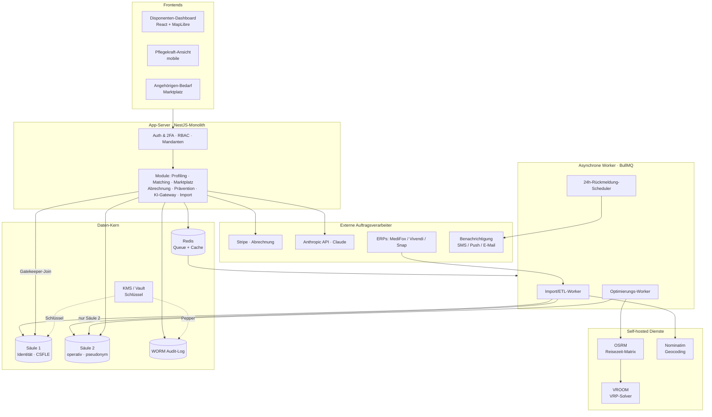

# Systemarchitektur (Überblick)

Tourenoptimierungs- und Vermittlungsplattform (ambulante Pflege). Gesamtsicht auf die
Komponenten, ihre Verantwortung und den Betrieb. Verdichtet die Einzelspezifikationen
(Stack, Datenmodell, API, Adapter, Datenschutz) zu einem Bild.

---

## 1. Komponenten und Datenflussdiagramm

**Leitende Datenflüsse:**

1. **Import:** ERP/CSV → ETL-Worker → Normalizer → Geocoding (Nominatim) → **Säulen-Split**
   (PII → Säule 1, operativ → Säule 2).
2. **Matching:** Bedarf/Klientenprofil → App (Matching) → Job-Queue → Optimierungs-Worker
   liest **nur Säule 2** + OSRM-Matrix → VROOM → Fit-Score → zurück ins Dashboard.
3. **Marktplatz:** Angehöriger → Bedarfsformular → App → Säule 2 (Bedarf) + Säule 1
   (Kontakt, gesperrt) → Benachrichtigung an Dienste → Angebote → Auswahl →
   **Kontaktfreigabe** (Säule 1 → Dienst) → Abrechnungs-Event (Stripe). Der Scheduler
   überwacht die 24-h-Frist.
4. **KI-Lotse:** Angehöriger ↔ KI-Gateway ↔ Anthropic API (pseudonymisierter Kontext, Tool Use).
5. **Betroffenenrechte:** Gatekeeper-Join (Säule 1 + 2) für Auskunft; Crypto-Shredding für
   Löschung mit Audit-Eintrag.

Architektonischer Kern: Der Optimierungs-Worker hat **keinen Pfad zu Säule 1** — die
RBAC-Grenze ist im Diagramm sichtbar.

---

## 2. Kernkomponenten und Verantwortung

| Komponente | Verantwortung | Technologie |
|---|---|---|
| Disponenten-Dashboard | Tourenplanung, Lückenfüllung, Kennzahlen | React, MapLibre GL |
| Pflegekraft-Ansicht | Tour des Tages, Navigation-Übergabe, offline-tauglich | React (mobile) |
| Angehörigen-/Marktplatz-Frontend | Bedarfserfassung, Reverse Bidding, kostenlose Tools | React (mobile-first) |
| App-Server (Monolith) | Auth/2FA, RBAC, Mandanten, Orchestrierung, Geschäftslogik aller Module | NestJS |
| Import/ETL-Worker | Quelldaten normalisieren, geocodieren, Säulen-Split | Node, BullMQ |
| Optimierungs-Worker | Fit-Score, marginale Einfügekosten, Re-Optimierung (nur Säule 2) | Node, VROOM/OSRM |
| 24h-Scheduler | Fristüberwachung, verbindliche Absage, Benachrichtigungs-Fan-out | BullMQ (delayed jobs) |
| OSRM | Reisezeit-Matrizen (pro Region) | OSRM (self-hosted) |
| VROOM | Vehicle-Routing mit Zeitfenstern | VROOM (self-hosted) |
| Nominatim | Adresse → Koordinaten ohne Datenabfluss | Nominatim (self-hosted) |
| MongoDB | Säule 1 (CSFLE), Säule 2, WORM-Audit-Log | MongoDB 7.x |
| Redis | Job-Queue + Cache (heiße Reads, keine PII) | Redis |
| KMS / Vault | Schlüsselverwaltung, Crypto-Shredding, Audit-Pepper | AWS KMS / HashiCorp Vault |
| Stripe | Abrechnung (Abo, Vermittlung, Express) | Stripe (Auftragsverarbeiter) |
| Anthropic API | KI-Pflegelotse (Dialog, Tool Use) | Claude Sonnet / Haiku |
| ERP-Adapter | Anbindung der Branchensoftware (Aufsatz, nicht Ersatz) | Ports & Adapters |

---

## 3. Betrieb und Deployment

### Hosting und Souveränität

- **Compute** (App, Worker, Redis, OSRM, VROOM, Nominatim) auf **Hetzner Cloud (DE)**.
- **Datenbank** auf **MongoDB Atlas (Region EU)** — oder, für maximale Souveränität, selbst
  gehostet auf Hetzner (offener Punkt O3).
- **Schlüssel** im KMS außerhalb des DB-Servers (AWS KMS `eu-central-1` oder Vault).
- Alle externen Dienste sind Auftragsverarbeiter mit AVV; Verarbeitung in der EU.

### Containerisierung und CI/CD

- **Docker + docker-compose** (Solo-Maßstab; kein Kubernetes — Prinzip P7).
- **GitHub Actions:** Build → Testpyramide → Abnahme-Gates → Deployment. Roter Test blockiert
  den Merge.
- **Umgebungen:** Dev → CI → Staging (nur synthetische Daten) → Produktion. Stripe im
  Test-Modus, Anthropic gemockt/Sandbox, OSRM mit kleinem OSM-Extrakt.

### Skalierung

- **Zustandslose App-Instanzen** hinter Load Balancer skalieren horizontal.
- **Worker** skalieren als Queue-Consumer **unabhängig** vom Web-Tier — die rechenintensive
  Last wächst getrennt.
- **OSRM pro Region** (geografisches Sharding): neue Region = weitere OSRM-Instanz.
- **MongoDB** zunächst vertikal (Atlas), später Sharding nach `tenant_id`.

### Verfügbarkeit und Wiederherstellung

- Realistisches SLO für den Solo-Betrieb: **99,5 %** — entschärft durch die Aufsatz-Rolle
  (das ERP bleibt System of Record).
- Replica-Set mit automatischem Failover; Health-Checks; Auto-Restart; zustandslose
  Instanzen leicht ersetzbar.
- **Graceful Degradation:** Der Lese-Pfad (Touren anzeigen) ist unabhängig vom schweren
  Worker; fällt die Optimierung aus, bleibt das Dashboard nutzbar.
- **Backup/Restore:** Atlas-Backups; nach jedem Restore räumt ein Skript anhand der
  Tombstone-Liste gelöschte `pseudonym_ids` ab (Crypto-Shredding-bewusst).

### Beobachtbarkeit und Sicherheit im Betrieb

- **Strukturierte Logs ohne PII**, Uptime-Monitor und Alerting (eine Person wird rechtzeitig
  benachrichtigt); optional Grafana/Loki.
- **Secrets** nicht im Repo; Zugriff über KMS/Vault.
- **Dependency-Scanning** (Dependabot/`npm audit`), regelmäßiges Patching, Pentest vor
  Go-Live.

### Deployment-Strategie

- **Gestaffelter Rollout:** zuerst Pilotregion (Freiburg), danach Ausweitung.
- Rolling/Blue-Green für die zustandslose App; Schema-Migrationen vorwärtskompatibel.
- Das **Datenschutz-Gate (DSFA)** ist die nicht verhandelbare Hürde vor jedem produktiven
  Go-Live.

---

## Querbezug

Die Architektur fügt die Einzelspezifikationen zusammen: das 2-Säulen-Datenmodell als Kern,
self-hosted Routing/Geocoding für Souveränität und Performance, entkoppelte Worker für
Skalierung und ein bewusst schlanker, solo-betreibbarer Betrieb (P7). Sie bleibt eingebettet
in die Lösungsprinzipien und das Datenschutzkonzept.
